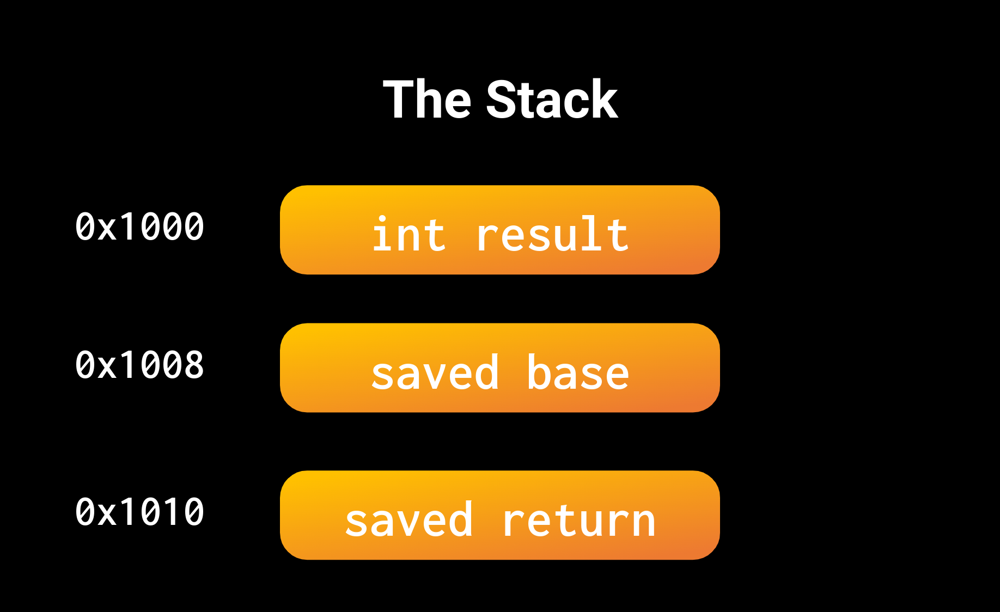
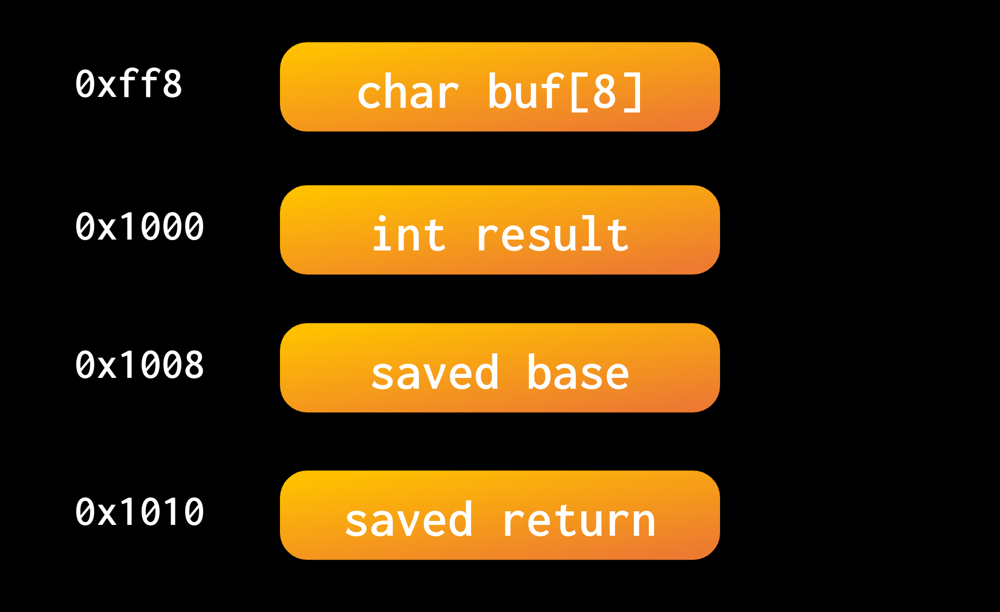

# Binary Exploitation (pwn)

## Introduction
When we run a program, we expect it to take input data, whether it be through files, user input, or internet connections, and produce meaningful output. The underlying code of the program handles all the logic and control flow within the program. However, either from quirks of the language used, or oversights from the programmer themselves, it's possible to introduce bugs that allow end users of a program to take control of the program in unintended ways.

This is the core goal of binary exploitation: Take a binary executable, provide it with input data to take control of the control flow or corrupt internal structures, and have it do something unintended (and usually unsafe). Executables often interact with files on the host computer, or run other programs (through functions like `system` or `exec`). If a user only has an exposed text interface over the network of a running program, it is intended that they are only ever interacting with the program as written. If they provide malicious input causes the program to read secure files, or open a shell session on the host machine, it suddenly becomes a major security vulnerability for the host machine.

### Fall CTF
We have provided a series of challenges designed to explore and teach the fundamentals of how program handle data and control flow, and how unsafe programming practices allow a user to take control of these programs without having access to the host machine, yet able to access the host's filesystem and programs.

**Pwn is hard.** To begin, you need to be somewhat comfortable with programming (or at least understanding code) in a lower level language (like C or C++). This post will attempt to explain underlying structures when running a program, but if you still feel stuck, feel free to ask for help from sigpwny members, or googling around about C functions and syntax. `man` pages are your friend. We want you to engage with these challenge as much as possible, so there are several hints and annotations within the code to help you get started.

As you read this guide, try each of the challenges. We give the executables and Makefiles for you to run, build, and debug locally. You can build with just `make`. If you get stuck, or unsure how to proceed in any challenge, return here and read each of the following sections carefully. Relevant sections will mention challenges that should be solvable after reading said section, although some additional googling/debugging/trial and error will be necessary.

## What is a Stack?
The stack is how programs manage memory per function call. Whenever you define a variable within a function, it's stored on the stack:
```c
int square(int x){
    int result = x*x;
    return result;
}
int main(){
    return square(7);
}
```

Calling `square` will store three things on the stack:
- The return pointer
- The base pointer
- The result variable
  




When square returns, it will pop everything off the stack. This is why you often hear the stack as automatic memory management. We will discuss what base and return pointers are in the next section. For right now, understand that a call to a function stores some bookkeeping for control flow, then all the user defined variables.

### `gets`
`gets` is a function that requests user input, and saves it to a character buffer. Here's an example:

```c
int main(){
    int result = 15
    char buf[8];
    gets(buf);
    return result;
}
```

`gets` has a massive security flaw, **it does not restrict the number of bytes read.** `gets` doesn't return until you send a terminating character (e.g. newline), thus it'll read over any predefined buffer that you make. Consider the structure of the stack:



If we read more than 8 bytes (characters), what would happen to `result`? What about the saved base or return pointers?

We can set the value of these via a Buffer Overflow. If we read more than we have stack storage for, then we'll just continue reading into other saved values. When those saved values get referenced, they'll have values that we control.


### Fall CTF
Try to solve `Magic 101` and `Magic 102`. If you get stuck on `Magic 103`, continue on.
## How do Functions Return?
We're going to scope down a bit, and look at a bit of assembly for a function:
```asm
// function code omitted...
leave
ret
```
This is what the end of a function will look like in assembly. Regardless of whether you are returning a value or not, most functions will terminate with `leave` then `ret`. Your processor stores two pointers to the stack in *registers*. These registers are called `rbp` and `rsp`. Normally, they point to the most recent saved **B**ase **P**ointer, and the top of the **S**tack.

`leave` will set `rsp` to the current value of `rbp`, which will effectively pop all values off of the stack except for the saved base pointer and saved return pointer. Then, it will pop the saved base pointer into `rbp`. Now, `rsp` points to the saved return address.

Our processor has a pointer to program memory of the instruction it is currently executing. This pointer is stored in a register called `rip` (instruction pointer). Return addresses point to where in the program memory we should jump back to after calling a function. Normally, we calculate this return address right after our function call, then push it to the stack as the signal for a new function stack frame.

When we call `ret`, we pop the return address off of the stack, and set the instruction pointer (`rip`) to the return address.

But again, we store the return address on the stack. This means if we have a buffer overflow, can we control where our program returns to?

You can view in gdb or a disassembler the location programs store functions. If you dont want to use such tools, `objdump -d challenge` will also print out the dissassembly of all the functions, and their hex locations.

### Fall CTF
Attempt to solve `Magic 103`. Once you do, you can read the next section to have the necessary knowledge for `I. The Pledge` and `II. The Turn`.

## How do Programs Read and Execute Code?
We mentioned before that the processor maintains a position in program memory of the current instruction it is executing. This pointer is again stored in the instruction pointer register: `rip`. Now, assembly just *assembles* into bytes. It's just a very simple abstraction layer over actual bytes that the processor reads as machine codes. This means, that the series of bytes `c9c3`, if read as code, would be the same as `leave; ret`.

This means that code, is just data. If we choose our data carefully, we can have our processor run meaningful code.

### Fall CTF

In `I. The Pledge`, the stack is executable. What happens when we place code on the stack, and we know the address of the stack?

It might be helpful to google shellcode and shellcode exploits. Additionally, look into the `asm()` function in pwntools. Look at the challenge hints as well!


## Format Vulnerability
`printf` is a very useful function for printing relevant text, as well as values within our program. If you call `printf("hello")`, we can expect our program to output "hello". However, we can print values from our program using **Format Specifiers**. If we include "%d" in our string, we can specify an integer value and print it out as a string:

```c
int x = 15;
printf("%d", x);
```
Now, our program prints "15". However, in C functions have a fixed number of arguments, right? Well, `printf` is a *variadic* function. We can have as many arguments as we need. So if we use `%d` 3 times, we can place 3 arguments and print all three.

```c
char* buf = "%p%p%p";
printf(buf,ptr1,ptr2,ptr3);
```
If we directly place a buffer into printf, format specifiers will be handled. The `%p` specifier will print a number in a pointer format (e.g. `0xcafecafe`).

This is extremely unsafe, because if the code *doesn't* have additional arguments, `printf` will just look through the stack for all the arguments it needs. If we don't have a stack leak, we could find one by printing values off of the stack until we find a base pointer, and calculate where we need to return to.

One last thing, if we need to use "really far arguments", we can specify positional arguments:

```c
// Prints int4.
printf("%4d",int1,int2,int3,int4,int5)
```

### Fall CTF
Try to solve `II. The Turn` to leak the stack and run shellcode.


## Return Oriented Programming (ROP)
To prevent these kinds of attacks, modern operating systems and processors have implemented a protection called NX (No eXecute). This protection marks certain regions of memory as non-executable. The stack is often marked as non-executable, meaning that even if we place code on the stack, the processor will refuse to run it.

However, there's another way we can take control of a program. Instead of jumping to a single piece of code that does everything for us, we can chain together small pieces of code that already exist in the program. These small pieces of code are called "gadgets". A gadget is a small sequence of instructions that ends with a `ret`. Remember that the `ret` instruction always pops a return address off of the stack, and so if we have a large enough buffer overflow, we can make each gadget return to the next gadget in our chain. If we can find enough gadgets, we can chain them together to do whatever we want.

Commonly, the program won't have many useful gadgets. However, the program will often link to shared libraries, like `libc`. These libraries contain many useful functions and gadgets that we can use. If we can find the base address of `libc` in memory, we can calculate the addresses of all the functions and gadgets within the library.

### Fall CTF
Try to solve `III. The Prestige`. You might have a hard time finding many useful gadgets in the program. Maybe a leak of some sort would be helpful?