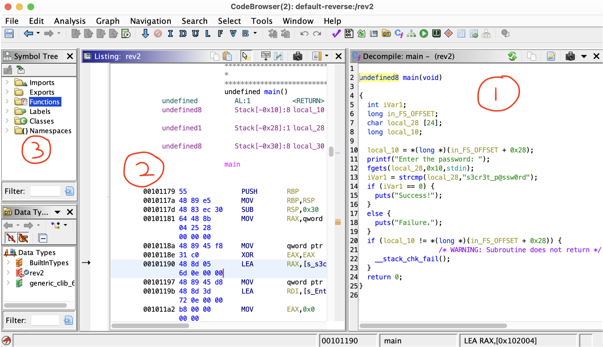
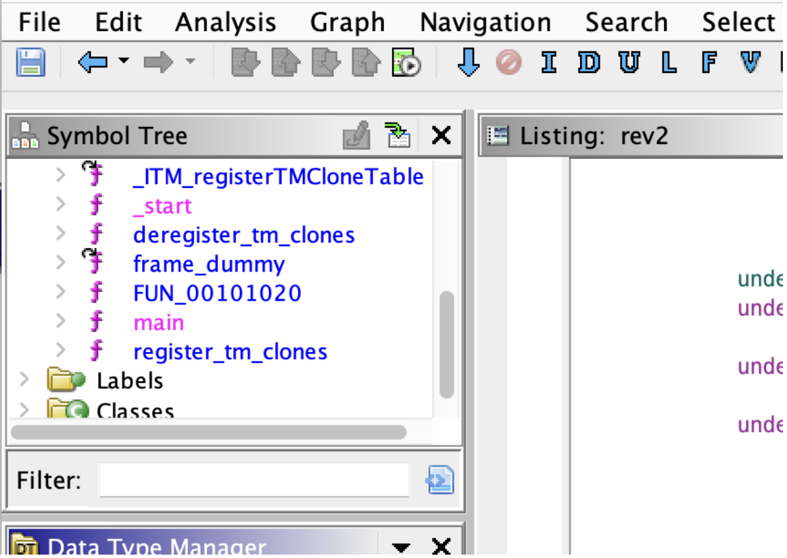

# **Reverse Engineering**

## **TL;DR**

- The goal: understand the program behavior.
- Usually this means finding the input that makes the program output "Success!" or speeding up a slow algorithm.

### **Past Meetings**

- Check out our [Reverse Engineering Setup meeting](https://sigpwny.com/meetings/general/2025-09-18/) for more details on installing our recommended tools.

## **Introduction**

### **Terminology**

Rev, short for **Rev**erse Engineering, is the process of understanding computer programs. The
goal is to figure out what the program does. Usually, programs are difficult
to understand, either intentionally or unintentionally.

#### **Abstractions**

Abstractions are simplifications made for a programming language that hides some of the complexity to make a language easier to use.

- Abstract (higher level) programs are easier to understand
- Languages like Python and JavaScript are higher level
- Languages like assembly and C are lower level
- As you modify a program to become more abstract (to better understand it), you lose some information in the process

#### **Static and Dynamic Analysis**

- Static analysis: reading code, using tools to understand code without running it
  - Good place to start, not great if there's a lot of code
- Dynamic analysis: running code, inspecting or modifying the program as it's running
  - Generally faster, captures entire program environment

## **Tools**

### **Bytecode Viewer**

#### **Installation**

See [https://github.com/Konloch/bytecode-viewer](https://github.com/Konloch/bytecode-viewer)

#### **When to use**

This program is used to decompile Java files, which usually have the .jar
extension

#### **How to use**

Simply import the java jar program into the bytecode viewer and see the
decompiled java code! This works by recovering the java code from the
compiled java bytecode.

### **Ghidra**

#### **Installation**

- See our [Reverse Engineering Setup meeting](https://sigpwny.com/meetings/general/2025-09-18/)
- Or read the [Installation Guide](https://ghidra-sre.org/InstallationGuide.html)

#### **When to use**

Use this tool for binaries, not python scripts. Ghidra "decompiles", or simplifies, binary programs into more human-readable "pseudo-C" code.

Ghidra is a **static analysis** tool.

#### **Interface**

To open a program in Ghidra, go to File -> Import File... -> select the file you want to analyze.

Click "OK" for all the auto analyze popups (there should be several).
Now, the interface should look like the above image.

1. is the decompiled code output. This is what you will be looking at for
   the most part. You can rename variables by clicking a variable and pressing
   "**L**". Change the type by right clicking and selecting **Retype Variable**.
2. is the assembly instructions. This won't be very helpful if you don't
   know assembly, and can be mostly ignored for the challenges at Fall CTF.
3. is the symbol tree. This shows you dierent named values that
   are present in the le. Click **Functions** and scroll down to select the **main**
   function. This shows you the first function that runs.

Here we can see the **main** function in the symbol tree. If there is no **main**,
click **\_start** and see what that function calls.

Above is a picture of the decompilation (disclaimer: this is not a challenge
from Fall CTF). Almost every function you see will have an if statement with
**\_\_stack_chk_fail** at the bottom. This is a check for the stack canary,
which is not relevant to any challenges here. It may be of more interest in
pwn challenge. The "local_10 = \*(long \*)(in_FS_OFFSET + 0x28);" line
at the top sets up the stack canary and can also be ignored.

Note that the variables are named with undescriptive names, such as
**iVar1** and **local_28**. This is because the decompiler does not know the
details of variables in the original function. As a result, it has to generate
variable names.

### **GDB**

#### **Installation**

- See our [Reverse Engineering Setup meeting](https://sigpwny.com/meetings/general/2025-09-18/)

#### **When to use**

Similarly to Ghidra, use this tool for binaries, not python scripts. GDB is
a debugger that runs programs, giving you the ability to stop, inspect, and
modify code as it is executing.

GDB is a **dynamic analysis** tool.

#### **Basics**

Run **gdb ./chal** on the command line, where **chal** is the name of the program.
Note that you must be on Linux (WSL works too). This will not work
for Apple Silicon Mac users.

**GDB** will launch you into a program with a dierent terminal prompt,
where each line starts with **(gdb)**. You interact with the program by typing
in commands

#### **Commands**

- misc
  - help \<command\>: get help about any of the commands listed here
- running
  - run: run the program from the start
  - quit: exit GDB
  - start: start the program and break on the **main** function
- breakpoints
  - break \<func\>+\<offset\>: set a breakpoint at the function \<func\>
    with an offset \<offset\>. Useful to get the offset from the **disas**
    command
- inspecting the program
  - disas \<func\>: disassemble the \<func\> function
  - info reg: print all the registers
  - x: print data (see help x for more info)
    - x/4gx 0x1234: print 4 QWORDS (64-bit values) in hex starting at address 0x1234
    - x/10i $rip: print 10 instructions starting at $rip (current
      instruction pointer)
    - x/7wx $rsp: print 7 WORDS (32-bit values) in hex starting
      at $rsp (stack pointer)
    - x/8bd $rdi: print 8 bytes in decimal starting at the address
      in $rdi
  - set: set values
    - set $rax=23: sets $rax to 23
    - set $rip+=4: adds 4 to $rip
      - this skips the current instruction, if it is 4 bytes long

#### **General Workflow**

- first, identify interesting places to set a breakpoint in Ghidra
- use the assembly instructions window in Ghidra to see the offset to break at
- run the program in GDB and set a breakpoint
- modify or print values as desired
- repeat until solved
