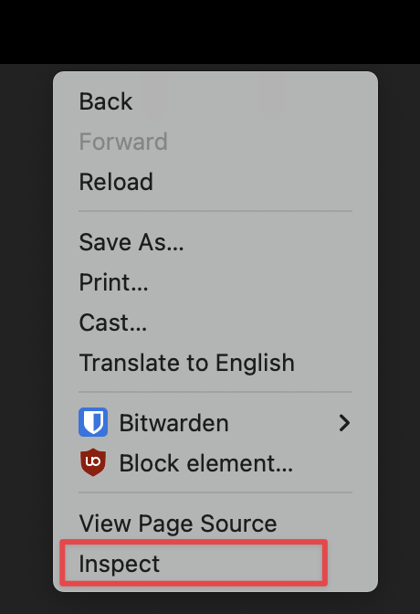
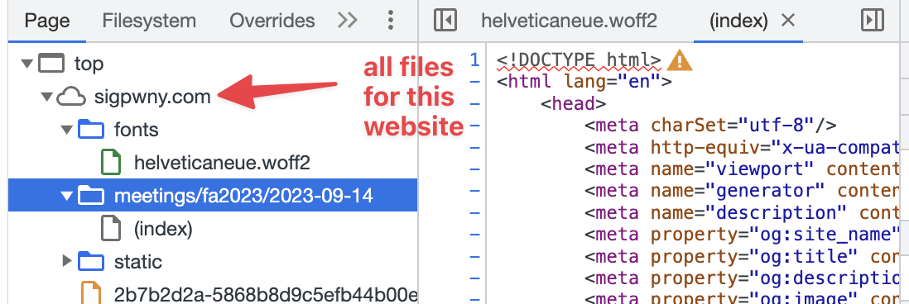

# Web

We have run two web meetings this semester:

- [Web Hacking I](https://sigpwny.com/meetings/general/2025-09-07/), covering HTML, CSS, and JavaScript
- [Web Hacking II](https://sigpwny.com/meetings/general/2025-09-11/), covering SQL injection and cross-site scripting (XSS)

## Website Structure

Websites use three main languages: HTML, CSS, and JavaScript. HTML is the skeleton of the website, and organizes each of the different elements onto the user's screen. CSS is how you edit and develop the styles on a website. The most important and widely used language within the web is JavaScript. JavaScript allows you to dynamically change elements within your site, have something happen when a button is pressed, or make a requests to other computers.

## Client-Server Model

When you click on a link within your browser, your computer makes a request to a server located at the address of the link you clicked. This request is then processed on the server's side, and the server sends back the webpage you want to load. This is the Client-Server Model. By manipulating processes within this model's process, you can access extra content on either the server or client side!

When content is sent between your computer and the server, it includes additional metadata called "Headers". Some of this data remains in your browser, either as **cookies** or **local storage** (technically more kinds).


- Cookies are saved per website, and are sent in each request. They can be changed by JavaScript or a request header.
- Local Storage is saved per website, but are not sent in each request. They can be changed by JavaScript in your browser.

## Developer Tools
Developer tools, or simply "DevTools," allows you to view additional information about a website. For our challenges, we recommend you use Google Chrome or Mozilla Firefox, and not Safari.

To open DevTools, hit `Ctrl + Shift + C` or if you are using a Mac, `Command + Shift + C`. Alternatively, right-click and hit inspect.



Chrome DevTools is a suite of software developer information for web development. During challenges, you will be able to poke around different tabs. Here are some helpful tabs to lookout for!
### Console
The console tab allows you to run your own JavaScript on the current page. It also displays logs or errors from the site's own JavaScript.


### Network
The network tab shows all information transmitted to and from your browser to the server.


### Sources
The sources tab shows a listing of all files on the server that were requested.



> [!TIP] Using breakpoints  
> When encountering JavaScript source files, you can use breakpoints by clicking left of the line number. Whenever the JavaScript is re-run (such as reloading the page), this will pause the execution at the breakpoint, allowing you to check the current state of variables.

### Application
The application tab shows the saved cookies, local storage, and other information stored in your browser.


Sometimes, cookies are stored as identifiers, which is not as helpful since that means that the application state is not provided directly to the client (and it's tracked on the server-side). However, you'll often that application state is stored directly in cookies, allowing you to inspect and modify them!

Sometimes cookies are encoded. Here are some common encodings you may see

**base64** - uses a character set of `abcdefghijklmnopqrstuvwxyzABCDEFGHIJKLMNOPQRSTUVWXYZ0123456789+=`


**URL encoding** - used to encode special characters so that they can be transmitted in URLs


You can use [CyberChef](https://gchq.github.io/CyberChef/) to decode many common encodings.

## Overriding Web Content

Sometimes, you'll want to manually override some parts of a webpage's contents in order to make debugging easier. Follow [Google Chrome's documentation "Override web content and HTTP response headers locally"](https://developer.chrome.com/docs/DevTools/overrides) for the specifics of how to override scripts and files.
### Why would I want to do this?

Often websites have security checks on the client rather than on the server. This is insecure because the client "owns" the scripts running on their machines and can modify them as they see fit.

Chrome DevTools (which is also available in Electron apps like Discord) can let you modify any kind of file sent to the client with a different version locally, and Chrome will serve you your modified version on future page loads.

This means if there is a check on the client-side JavaScript that prevents you from doing something, you can modify the JavaScript locally with the overrides and remove the check to send exactly what you want to send to the server.

For CTFs, this lets you use some of the code written into the challenge rather than recreating the entire environment in Python with `requests` for example.

Of course, this does not allow you to modify the code run on the server. If the server also has the necessary security checks, modifying the client is not effective.

## SQL Injection

More in-depth explanations can be found in the Web 2 slides about SQL.

SQL, or Structured Query Language is a language for fetching information from a server.

For example,

```sql
SELECT netid, firstname FROM students WHERE lastname = "Tables"
```


If code is written incorrectly, you can modify an SQL Statement as shown above.

More details on SQL: https://portswigger.net/web-security/sql-injection
Resource on SQL Union Attack: https://portswigger.net/web-security/sql-injection/union-attacks

## Command Injection

Command Injection lets you execute multiple Linux commands at the same time. It is very similar to SQL Injection, except instead of 
changing a database query, you are changing commands executed in the command line.

For example, in your terminal, you are able to execute multiple commands using the `;` ability

```
$> echo "command 1"; echo "command 2"
command 1
command 2
```

If you are able to "inject" something directly into the command you are executing, you can make it do additional things.

```
$> echo "YOUR INPUT"
```

If I had set `YOUR INPUT` to `-HI"; ls ; "BYE-`

then the command would look like

```
echo "-HI"; ls; "BYE-"
```

Some useful commands are:

+ `ls` - list files
+ `cat x.txt` - output the contents of the file `x.txt`

If you want more resources on learning the linux command line...

+ Review our [Setup/Terminal Meeting Slides](https://sigpwny.com/meetings/fa2023/2023-09-03/)

## Cross-Site Scripting (XSS)

Cross-Site Scripting is a vulnerability that allows an attacker to execute malicious scripts on a website. This can be used to steal cookies, redirect users to malicious websites, or deface the website.

I like to think of XSS as as another type of injection attack, but instead of injecting into a database or command line, you're injecting into the website's HTML.

For example, let's say you have a website that displays a user's name on the page. If the website includes the input directly into the HTML, you can put your own HTML code in the input and have it execute on the page.

```html
<p>Welcome, <span id="username">USER INPUT</span></p>
```

If I had set `USER INPUT` to `<script>alert("Hello!")</script>`, then the website would display a popup saying "Hello!".

```html
<p>Welcome, <span id="username"><script>alert("Hello!")</script></span></p>
```

More details on XSS: https://portswigger.net/web-security/cross-site-scripting

A useful resource for receiving requests is [webhook.site](https://webhook.site/). For example, if you need to extract some data from a website, you can have your XSS payload send a request to your webhook.site URL with the data you need.

Be careful when exfiltrating data to make sure the data on the page you are trying to extract is actually loaded. Also, make sure to go to `edit` and enable `Add CORS Headers` to allow the admin's browser to make requests to the site.

```js
window.addEventListener('load', () => {
    // ... your code here
});
```